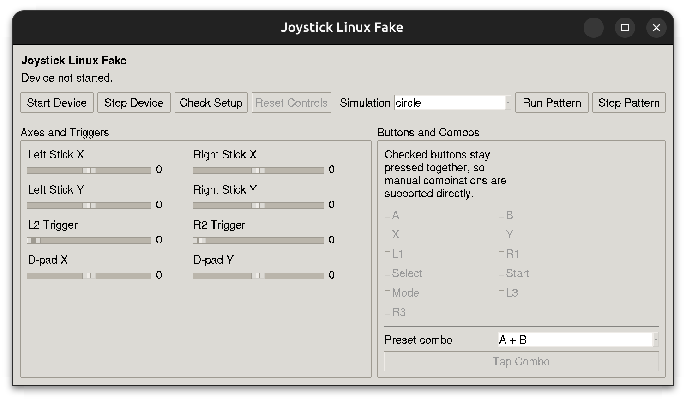
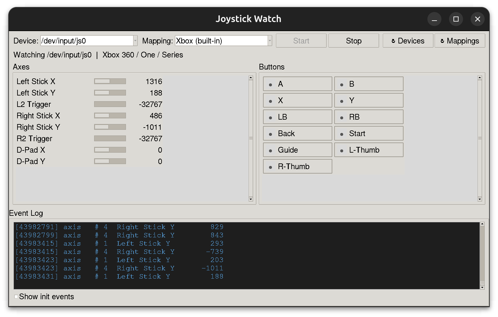

# Joystick Linux Fake

A small Python project for virtual joystick creation, real-time visualization, and portable joystick event parsing on Linux.

## Introduction

<table><tr>
<td></td>
<td></td>
</tr></table>

This project provides three tools:

| Tool | Purpose |
|------|---------|
| `joystick-linux-fake` | Create a **virtual** gamepad via `evdev.UInput` for local testing when a real controller isn't available. |
| `joystick_parser` | **Standalone single-file module** — drop it into any project to read real or virtual joystick input. Built-in Xbox / PS5 mappings with YAML config support. |
| `joystick_watch` | **Tkinter GUI** for real-time joystick visualization. Axis progress bars, button indicators, and a live event log. |

All three work together: create a virtual gamepad with `joystick-linux-fake`, then watch its output with `joystick_watch`, or parse its events programmatically with `joystick_parser`.

### Features

- `python-evdev` backend for virtual gamepad — no `python-uinput` dependency.
- Desktop GUI with sticks, triggers, face buttons, shoulder buttons, and combo presets.
- Five built-in simulation patterns: `circle`, `figure8`, `trigger-pulse`, `combo-demo`, `idle`.
- Standalone `joystick_parser` module — zero dependencies beyond stdlib (PyYAML optional).
- `joystick_watch` GUI — real-time axis bars, button indicators, event log.
- CLI modes for headless simulation, idle keep-alive, and environment checks.

### Requirements

- Linux
- Python 3.10+
- `python-evdev` (for `joystick-linux-fake`)
- Tkinter (for `joystick-linux-fake` GUI and `joystick_watch`)

Tkinter ships with most Linux Python builds. If your distribution splits it out, install `python3-tk` from your system package manager. `joystick_parser` has no additional dependencies (PyYAML is optional for custom `.yaml` mapping files).

## Quick Start

### 1. Install

```bash
git clone https://github.com/MasterYip/joystick_linux_fake.git && cd joystick_linux_fake
python -m pip install -e .
sudo modprobe uinput
```

### 2. Launch the GUIs

**joystick-linux-fake** — create and control a virtual gamepad:

```bash
joystick-linux-fake --mode gui
```

**joystick-watch** — visualize any joystick in real time:

```bash
joystick-watch
```

Open both side by side: drive the fake joystick GUI on one side, watch the output update live on the other.

### 3. Use joystick_parser in code

```python
from joystick_parser import JoystickParser

with JoystickParser("/dev/input/js0", mapping="xbox") as parser:
    snap = parser.get_snapshot()
    print(snap.axes["left_x"], snap.buttons["south"])
```

---

## Joystick Linux Fake

The core package creates a virtual dual-stick gamepad through `evdev.UInput`. It provides a Tkinter GUI for manual control, built-in simulation patterns, and a CLI.

### Installation

Load the kernel interface once:

```bash
sudo modprobe uinput
```

To persist across reboots:

```bash
echo "uinput" | sudo tee /etc/modules-load.d/uinput.conf
```

Install the package:

```bash
python -m pip install -e .
```

Grant `/dev/uinput` access (avoids needing `sudo`):

```bash
sudo usermod -a -G input "$USER"
echo 'KERNEL=="uinput", MODE="0660", GROUP="input"' | sudo tee /etc/udev/rules.d/99-uinput.rules
sudo udevadm control --reload-rules && sudo udevadm trigger
```

Log out and back in after changing group membership.

### Verification

Check setup:

```bash
joystick-linux-fake --mode check
```

Check the created device node:

```bash
ls -l /dev/input/js*
```

Watch with the visualization GUI:

```bash
joystick-watch
```

### GUI Usage

```bash
joystick-linux-fake --mode gui
```

The GUI layout is built dynamically from the selected mapping config.  By default it exposes the standard Xbox layout:

- Left and right stick sliders (`left_x`, `left_y`, `right_x`, `right_y`)
- Analog trigger sliders (`L2`, `R2`)
- Face buttons `A`, `B`, `X`, `Y`
- Shoulder buttons `L1`, `R1`
- `Start`, `Select`, `Mode`, `L3`, `R3`
- Preset combo buttons and manual multi-button holds

Manual combinations work by checking multiple buttons at once. The **Tap Combo** action sends a short simultaneous press for a preset combination.

Select a different joystick type with `--config`:

```bash
joystick-linux-fake --mode gui --config ps5
joystick-linux-fake --mode gui --config /path/to/custom.yaml
```

The GUI rebuilds its axes panel and button panel automatically to match the config.

### CLI Usage

All CLI modes accept `--config` to choose a joystick mapping:

```bash
# Built-in names
joystick-linux-fake --mode idle --config xbox
joystick-linux-fake --mode simulate --pattern circle --config ps5

# Custom YAML file
joystick-linux-fake --mode simulate --pattern combo-demo --config my_controller.yaml
```

**Idle** — keep the device available without moving controls:

```bash
joystick-linux-fake --mode idle
```

**Simulation** — run a built-in pattern headlessly:

```bash
joystick-linux-fake --mode simulate --pattern circle
joystick-linux-fake --mode simulate --pattern figure8
joystick-linux-fake --mode simulate --pattern trigger-pulse
joystick-linux-fake --mode simulate --pattern combo-demo
```

**Custom device name**:

```bash
joystick-linux-fake --mode simulate --device-name "CI Test Gamepad"
```

---

## joystick_parser

[`src/joystick_parser.py`](src/joystick_parser.py) is a **standalone single-file module** — drop it into any project that needs to read joystick input on Linux. It reads raw `/dev/input/js*` events and maps them through built-in or YAML configs.

Zero dependencies beyond the standard library. PyYAML is optional (only needed when loading custom `.yaml` mapping files).

### Quick Start

```python
from joystick_parser import JoystickParser

# Use a built-in mapping — no config file needed
with JoystickParser("/dev/input/js0", mapping="xbox") as parser:
    snap = parser.get_snapshot()
    print(snap.axes["left_x"], snap.buttons["south"])  # 0, False

    for ev in parser.drain_events():
        print(f"{ev.label}: {ev.value}")
```

### Built-in Mappings

| Key | Controller | Buttons | Axes |
|-----|-----------|--------:|-----:|
| `xbox` | Xbox 360 / One / Series | 11 | 8 |
| `ps5` | PS5 DualSense (hid-playstation) | 15 | 8 |

```python
from joystick_parser import get_mapping

cfg = get_mapping("xbox")                         # built-in, no filesystem hit
cfg = get_mapping("ps5")                          # built-in
cfg = get_mapping("/path/to/my_controller.yaml")  # custom YAML file
```

### Custom YAML Mappings

Define your own controller layout as a YAML file:

```yaml
# my_controller.yaml
name: "Custom Gamepad"
version: 1

axes:
  0: {logical: left_x,  label: "Left Stick X",  min: -32768, max: 32767}
  1: {logical: left_y,  label: "Left Stick Y",  min: -32768, max: 32767}
  # ...

buttons:
  0: {logical: south, label: "A"}
  1: {logical: east,  label: "B"}
  # ...
```

Place YAML files in `~/.config/joystick_watch/mappings/` or pass an absolute path.

### API Overview

| Method | Description |
|--------|-------------|
| `JoystickParser(device_path, mapping)` | Create a parser. `mapping` is `"xbox"`, `"ps5"`, a `JoyMappingConfig`, or a YAML path. |
| `parser.start()` / `parser.stop()` | Start / stop the background reader thread. |
| `parser.get_snapshot() -> JoystickSnapshot` | Thread-safe copy of current axes and button state. |
| `parser.drain_events() -> list[JoystickEvent]` | Atomically drain the event queue (for polling consumers). |
| `parser.on_event(callback)` | Register a callback invoked from the reader thread for every event. |
| `JoystickParser.list_devices()` | Return sorted list of `/dev/input/js*` paths. |

The parser is also a context manager: `with JoystickParser(...) as p: ...`

---

## joystick_watch

`joystick-watch` is a Tkinter GUI for real-time joystick visualization, built on top of `joystick_parser`.

### Quick Start

```bash
# Launch the GUI — auto-detects device, defaults to Xbox mapping
joystick-watch

# Specify device and mapping
joystick-watch --device /dev/input/js1 --config ps5

# Info-only modes
joystick-watch --list-devices
joystick-watch --list-mappings

# Run from source
PYTHONPATH=src python -m joystick_watch
PYTHONPATH=src python -m joystick_watch --list-mappings
```

### GUI Layout

- **Toolbar** — device selector, mapping selector, Start / Stop buttons, refresh buttons, status bar
- **Axes panel** — progress bars with live numeric value labels for every axis in the mapping
- **Buttons panel** — color-coded indicators (green = pressed, grey = released)
- **Event log** — dark-themed scrollable text widget showing every event with timestamp, number, label, and value. Init events can be toggled with a checkbox.

### Mapping Selection

The mapping dropdown shows:

1. **Built-in** `xbox` and `ps5` mappings (no filesystem required)
2. **YAML files** discovered from the shipped `configs/joystick_mappings/` directory and `~/.config/joystick_watch/mappings/`

Select a different mapping at any time before starting — the panels rebuild automatically.

---

## Troubleshooting

### `virtual input interface not ready`

```bash
sudo modprobe uinput
```

### `/dev/uinput writable: FAIL`

Run with `sudo` or grant your user access through the `input` group and udev rule described in the Installation section.

### GUI does not open on a remote or headless system

Use the CLI simulation mode instead:

```bash
joystick-linux-fake --mode simulate --pattern combo-demo
```

### `python-evdev installed: FAIL`

```bash
python -m pip install evdev
```

### No joystick devices found

If `joystick_watch` shows no devices, make sure a virtual gamepad is running or a physical controller is connected:

```bash
ls -l /dev/input/js*
joystick-linux-fake --mode idle    # creates /dev/input/js* if missing
```

---

## Project Layout

```text
.
├── dummy_joystick.py
├── watch_js.py                           # Lightweight CLI watcher
├── pyproject.toml
├── requirements.txt
├── setup.py
├── src/
│   ├── joystick_parser.py                # Standalone event reader (no deps)
│   ├── joystick_linux_fake/              # Virtual gamepad package
│   │   ├── cli.py
│   │   ├── controller.py
│   │   ├── device.py
│   │   ├── gui.py
│   │   ├── simulations.py
│   │   └── state.py
│   └── joystick_watch/                   # Visualization GUI
│       ├── __init__.py
│       ├── __main__.py
│       ├── app.py
│       └── configs/
│           └── joystick_mappings/
│               ├── xbox.yaml
│               └── ps5.yaml
└── tests/
    ├── test_cli.py
    ├── test_simulations.py
    ├── test_joystick_parser.py
    └── test_joystick_watch.py
```

## Development

Run the test suite:

```bash
PYTHONPATH=src python -m unittest discover -s tests
```

## Notes

- `joystick_parser.py` is a **standalone module** — copy it into any project that needs Linux joystick input. No dependencies beyond the standard library (PyYAML optional).
- `joystick-watch` works with both real and virtual joysticks; it's the recommended tool for visual verification.
- The virtual gamepad creates a standard dual-stick device through `evdev.UInput`. There is no `python-uinput` backend.
- The active `/dev/input/js*` index depends on what is already connected on the host.
- `dummy_joystick.py` is kept as a compatibility launcher for direct repository use (`sudo python3 dummy_joystick.py --mode gui`).

## Acknowledgments

- Built with [`python-evdev`](https://python-evdev.readthedocs.io/)
- Inspired by the Linux `joystick` and `evtest` tools
- Uses PyYAML for external mapping configs
